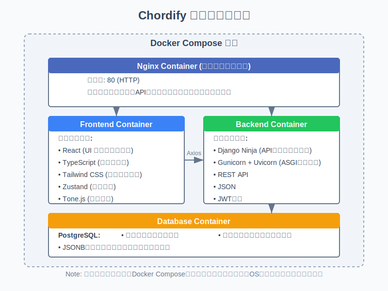

# ギターコード学習・管理アプリ

## 目次
- [概要](#概要)
- [システム構成図](#システム構成図)
- [技術スタック](#技術スタック)
  - [フロントエンド](#フロントエンド)
  - [バックエンド](#バックエンド)
  - [開発ツール](#開発ツール)
  - [インフラ](#インフラ)
- [システム概要](#システム概要)
- [デプロイ方式](#デプロイ方式)
- [開発ワークフロー](#開発ワークフロー)

## 概要
このプロジェクトはギターコードを視覚的に記録・管理し、日々のコード学習を効率的に支援するWebアプリケーションです。

## システム構成図

## 技術スタック

### フロントエンド
- React（ルーティング：React Router、コンパイラー：Rspack）
- TypeScript
- Tailwind CSS
- Zustand
- Axios
- Tone.js
- Recharts

### バックエンド
- Django Ninja
- PostgreSQL
- Gunicorn + Uvicorn Worker（ASGI）

### 開発ツール
- ruff (リンター・フォーマッター)
- mypy (型チェック)
- pytest / pytest-cov (テスト・カバレッジ)
- Makefile / Taskfile (開発ワークフロー)

### インフラ
- Docker / docker-compose
- Nginx（リバースプロキシ）

## システム概要

Chordifyは以下のような3層アーキテクチャで構築されています：

1. **プレゼンテーション層**
    - React SPA（Single Page Application）
    - Tailwind CSSによるレスポンシブUI
    - Zustandによる状態管理
    - Axiosを用いたバックエンドとの通信

2. **ビジネスロジック層**
    - Django Ninjaフレームワーク（FastAPIスタイルのPython RESTフレームワーク）
    - JWT認証による安全なAPIアクセス
    - ASGIサーバー（Gunicorn + Uvicorn）による高速レスポンス

3. **データ層**
    - PostgreSQLデータベース
    - JSONBデータ型を活用した柔軟なコード情報の格納
    - Django ORMによるデータアクセス

## デプロイ方式

Dockerコンテナ技術を活用し、以下のコンテナで構成されています：

1. **Nginxコンテナ**：リバースプロキシとして静的ファイル配信とルーティングを担当
2. **フロントエンドコンテナ**：Reactアプリケーションを実行
3. **バックエンドコンテナ**：Django Ninja APIを実行
4. **データベースコンテナ**：PostgreSQLを実行

これらはすべてDocker Composeで管理され、開発環境と本番環境での一貫性を確保します。

## 開発ワークフロー

高品質なコードを維持するため、以下の開発ワークフローを採用しています：

1. コードリンティングと自動フォーマット（ruff）
2. 静的型チェック（mypy）
3. 単体テストとカバレッジ計測（pytest, pytest-cov）
4. MakefileとTaskfileによる開発コマンドの標準化

詳細は [開発環境構築手順](./06_setup.md) を参照してください。
