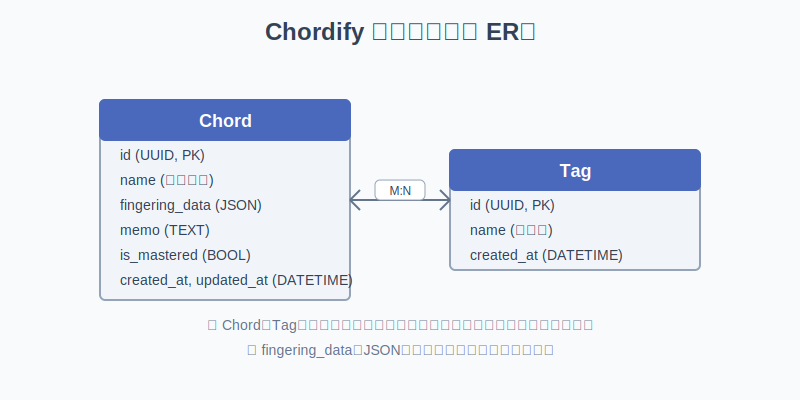

# データモデル設計（ER図）

## ER図



## Chord（コード情報）
- id (UUID, PK)
- name (コード名)
- fingering_data (JSON)
- memo (TEXT)
- is_mastered (BOOL)
- created_at, updated_at (DATETIME)
- tags (ManyToMany → Tag)

## Tag（タグ情報）
- id (UUID, PK)
- name (タグ名)
- created_at (DATETIME)

## fingering_data JSONフォーマット

コードの指板図の押弦位置を以下のJSONフォーマットで管理します。

```json
{
  "positions": [
    {"string": 6, "fret": "x"},
    {"string": 5, "fret": 3},
    {"string": 4, "fret": 2},
    {"string": 3, "fret": 0},
    {"string": 2, "fret": 1},
    {"string": 1, "fret": 0}
  ]
}
```

- `"string"` は弦番号を示します（6が一番太い弦、1が一番細い弦）。
- `"fret"` は押弦するフレット番号を示し、
  - 数値：押弦するフレット
  - `"0"`：開放弦
  - `"x"`：ミュート（鳴らさない弦）
を表します。

## データモデルの実装例（Django）

```python
from django.db import models
import uuid

class Tag(models.Model):
    id = models.UUIDField(primary_key=True, default=uuid.uuid4, editable=False)
    name = models.CharField(max_length=50, unique=True)
    created_at = models.DateTimeField(auto_now_add=True)

    def __str__(self):
        return self.name

class Chord(models.Model):
    id = models.UUIDField(primary_key=True, default=uuid.uuid4, editable=False)
    name = models.CharField(max_length=100)
    fingering_data = models.JSONField()
    memo = models.TextField(blank=True, null=True)
    is_mastered = models.BooleanField(default=False)
    created_at = models.DateTimeField(auto_now_add=True)
    updated_at = models.DateTimeField(auto_now=True)
    tags = models.ManyToManyField(Tag, related_name='chords', blank=True)

    def __str__(self):
        return self.name
```
