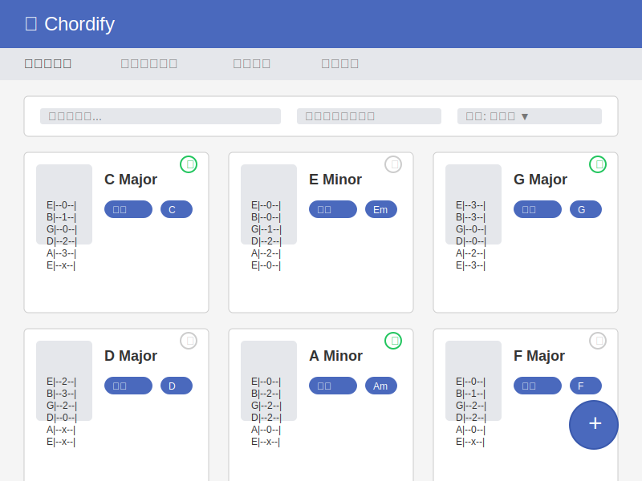

# UIワイヤーフレーム

## 画面構成
- コード一覧画面
- コード詳細画面
- コード登録・編集画面
- ランダムコード表示画面（毎日の練習用）
- 学習進捗グラフ画面
- タグ管理画面

## 画面詳細

### コード一覧画面

コード一覧画面では以下の機能を提供します：
- 登録済みコードをカード形式で一覧表示
- コード名、押弦位置図、タグ、習得状態を表示
- 検索やフィルタリング機能でコードを絞り込み
- 新規コード登録へのアクセス（右下の+ボタン）

### コード詳細画面

コード詳細画面では以下の機能を提供します：
- コード名、タグ、習得状態の表示
- 押弦位置図の詳細表示
- 音名/度数表示の切り替え
- 音声再生機能
- コードに関するメモの表示
- 編集、削除、習得状態切り替えなどの操作

### コード登録・編集画面

コード登録・編集画面では以下の機能を提供します：
- コード名の入力
- タグの選択または新規作成
- 視覚的なコードエディタで押弦位置を設定
- 操作ツールで押弦位置を簡単に編集（X, 0, 1, 2, 3など）
- メモの入力
- 習得状態の設定
- 保存とキャンセル機能

### ランダム練習画面

ランダム練習画面では以下の機能を提供します：
- 日替わりでランダムに選ばれた未習得コードを表示
- コード名、タグ、押弦位置図を表示
- 音声再生機能
- 前後のコードへナビゲーション
- 習得済みボタンで学習状態を更新

### 学習進捗グラフ画面

学習進捗グラフ画面では以下の機能を提供します：
- 登録コード総数、習得済みコード数、習得率のサマリー表示
- 時間経過による習得コード数の推移をグラフで表示
- 期間フィルターで表示範囲を調整可能

### タグ管理画面

タグ管理画面では以下の機能を提供します：
- 新規タグの追加フォーム
- 登録済みタグ一覧の表示（タグ名、関連コード数）
- タグの編集と削除機能
- ページネーション

## レスポンシブデザイン

すべての画面はレスポンシブデザインとし、以下のデバイスサイズに対応します：
- デスクトップ（1024px以上）
- タブレット（768px～1023px）
- モバイル（767px以下）

モバイル表示ではナビゲーションをハンバーガーメニューに切り替え、コンテンツを縦長に再配置します。
